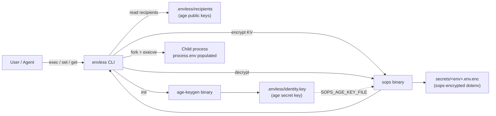

`envless` is a thin orchestrator over two external binaries (`age-keygen`
and `sops`) and the filesystem. There is no daemon, no cache, no in-memory
state across invocations. Every command reads from disk, shells out, and
exits.

## Data flow



## Components

| Component | Role | Code |
|---|---|---|
| `cmd/envless` | argv entry, version flag | 20 LOC |
| `internal/ecmd` | cobra subcommand wiring | ~150 LOC |
| `internal/store` | filesystem layout, KV operations | 159 LOC |
| `internal/sopswrap` | shells out to `sops`, dotenv roundtrip | 102 LOC |
| `internal/execenv` | builds env array, spawns child | 64 LOC |
| `pkg/envparse` | parses `.env` (quotes + comments) | 51 LOC |

## On-disk layout

```
your-repo/
├── .envless/
│   ├── identity.key       # age secret key — gitignored
│   └── recipients         # age public keys — committed
├── secrets/
│   ├── dev.env.enc        # sops-encrypted, committed
│   └── prod.env.enc
└── .gitignore             # auto-appended on migrate
```

`.envless/identity.key` is never written into a commit. `envless init`
permissions it `0600` and the repo `.gitignore` ships with the path
already excluded.

## Why two binaries (age + sops)?

`age` provides the cryptographic primitive: file-level encryption against
a list of recipients. `sops` adds per-key encryption with metadata (data
keys, MACs, recipient lists) and a clean roundtrip for dotenv format.
`envless` does not re-implement either. The trust surface is whatever
trust you already place in `age` and `sops` — both well-audited and
narrowly scoped.

See [Security → Cryptography](../../security/cryptography/) for the
formal primitives.
