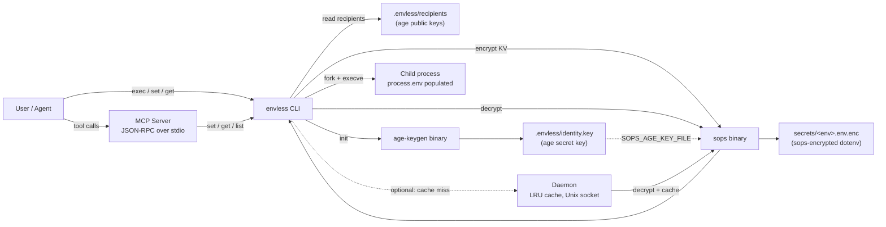

`envless` is a thin orchestrator over two external binaries
(`age-keygen` and `sops`) and the filesystem. The default mode is
stateless: every command reads from disk, shells out, and exits. An
**optional** daemon (`envless daemon`) provides an in-memory
decrypt-cache for latency-sensitive workflows, and an MCP server
(`envless mcp`) exposes the tool to AI agents via JSON-RPC 2.0 over
stdio. Neither runs unless explicitly started.

The whole point is to replace `.env` with something that survives
multiple agents, multiple teammates, and shared logs — without growing
into a SaaS. This page narrates that design, then walks the lifecycle
of a single secret from `init` to `exec`.

## The .env problem

`.env` files were designed for one human, one machine, one trust
boundary. AI agents shatter all three.

### What `.env` assumes

1. **One person uses the secrets.** No granular access control.
   Whoever has the file has everything.
2. **The machine is trusted.** Plaintext on disk is fine because only
   you read it.
3. **You distribute out-of-band.** Slack DMs, password managers,
   "ping me when you onboard."

Those assumptions held when codebases had three developers and zero
autonomous processes touching the file. They no longer hold.

### What changed

- **Multiple agents per developer.** Background sessions, scheduled
  jobs, delegated panes. Each may need different scopes.
- **Logs in shared contexts.** Agent transcripts, asciinemas,
  screen-shares. A single `cat .env` becomes a public broadcast.
- **CI/CD shares the same file.** GitHub Actions secrets diverge from
  local `.env`, drift accumulates, prod breaks.
- **Rotation is impossible at scale.** Rotating one API key means
  updating N humans, M agents, K CI environments. Most teams skip.

### What envless does differently

```
.env (plaintext, gitignored)        →  secrets/*.env.enc (encrypted, committed)
shared password / file              →  per-identity age keypairs
out-of-band onboarding              →  PR adds pubkey to recipients
"hope it doesn't leak"              →  recipient list is the access-control plane
rotation requires N updates         →  rotation re-encrypts to current recipients
```

The substrate is two well-audited primitives —
[age](https://age-encryption.org/v1) (file encryption) and
[sops](https://getsops.io/docs/) (per-value encryption with recipient
lists). `envless` is the agent-facing ergonomics layer on top.

### Why not just use sops directly?

You can. We did for a while. Three issues kept biting:

1. **No `process.env` bridge.** `sops exec-env` exists but only handles
   dotenv format awkwardly. `envless exec` is the same idea, polished.
2. **No identity bootstrap.** sops assumes you already have an age
   key. Most devs do not. `envless init` solves it in one command.
3. **No migration story.** Going from `.env` to `secrets/dev.env.enc`
   is a half-dozen manual steps. `envless migrate .env` does it
   idempotently.

`envless` is sops with the rough edges removed and an opinion about
how agents fit in.

## Data flow



## Components

| Component | Role | Code |
|---|---|---|
| `zig/src/main.zig` | argv entry, version flag | 24 LOC |
| `zig/src/cli/*.zig` | hand-rolled subcommand dispatcher (no cobra) | ~1553 LOC |
| `zig/src/store.zig` | filesystem layout, KV operations | 414 LOC |
| `zig/src/sops.zig` | shells out to `sops`, dotenv roundtrip | 338 LOC |
| `zig/src/execenv.zig` | builds env array, spawns child | 269 LOC |
| `zig/src/envparse.zig` | parses `.env` (quotes + comments) | 157 LOC |
| `zig/src/daemon.zig` | optional decrypt-cache daemon (Unix socket, LRU cache) | 712 LOC |
| `zig/src/ipc.zig` | wire protocol for daemon ↔ client IPC | 378 LOC |
| `zig/src/mcp.zig` | MCP server (JSON-RPC 2.0 over stdio) for agents | 1037 LOC |
| `zig/src/backup.zig` | tar.gz backup of encrypted artefacts | 482 LOC |
| `zig/src/launchd.zig` | macOS launchd supervisor integration | 351 LOC |
| `zig/src/systemd.zig` | Linux systemd supervisor integration | 273 LOC |

Single static binary at `zig-out/bin/envless` (~150 KB stripped on
aarch64-linux, ReleaseSmall). No runtime, no GC; one dependency
(libc). Cross-compiled by `zig build release` for the four release
targets.

## On-disk layout

```
your-repo/
├── .envless/
│   ├── identity.key       # age secret key — gitignored
│   └── recipients         # age public keys — committed
├── secrets/
│   ├── dev.env.enc        # sops-encrypted, committed
│   └── prod.env.enc
└── .gitignore             # auto-appended on migrate
```

`.envless/identity.key` is never written into a commit. `envless init`
permissions it `0600` and the repo `.gitignore` ships with the path
already excluded. See [CLI reference → File formats](/envless/cli/#file-formats)
for the byte-level format of each file.

## Why two binaries (age + sops)?

`age` provides the cryptographic primitive: file-level encryption
against a list of recipients. `sops` adds per-key encryption with
metadata (data keys, MACs, recipient lists) and a clean roundtrip for
dotenv format. `envless` does not re-implement either. The trust
surface is whatever trust you already place in `age` and `sops` — both
well-audited and narrowly scoped. See
[Security → Cryptography](/envless/security/#cryptography-age--sops)
for the formal primitives.

## Optional: Daemon mode

The daemon (`zig/src/daemon.zig`) is an **opt-in** process that caches
decrypted env maps in memory for up to 60 seconds per `(repo, env)`
pair, using an LRU eviction policy. It listens on a Unix domain socket
whose path is resolved via `XDG_RUNTIME_DIR` or `~/.cache/envless/sock`.

When the daemon is running, `envless exec` and `envless get` check the
socket first. On a cache hit, the sops decrypt is skipped entirely —
latency drops from ~200 ms (sops spawn + decrypt) to sub-millisecond
(socket round-trip). On a cache miss, the daemon decrypts, caches, and
returns.

The wire protocol (`zig/src/ipc.zig`) is line-oriented JSON over the
Unix socket: one JSON request per line, one JSON response per line.
Requests larger than 1 MB are rejected with an `err` response to
prevent unbounded memory growth.

Daemon supervision is platform-specific:
- **macOS**: `zig/src/launchd.zig` generates a `~/Library/LaunchAgents/envless.plist`
- **Linux**: `zig/src/systemd.zig` generates a `~/.config/systemd/user/envless.service`

Neither is installed by default. `envless daemon install` creates the
unit file and enables it; `envless daemon uninstall` removes it.

See [Security → What envless does NOT protect against](/envless/security/#what-envless-does-not-protect-against)
for the threat-model implications of resident plaintext.

## Optional: MCP server

The MCP server (`zig/src/mcp.zig`) exposes envless to AI agents via
[Model Context Protocol](https://modelcontextprotocol.io/) (JSON-RPC 2.0
over stdio). It allows agents to call `set`, `get`, `list`, `migrate`,
`envs`, `whoami`, and `exec` as structured tool calls without shelling
out to the CLI.

The server is rooted at the cwd of the process that launched it —
typically the Claude Code (or other MCP client) session directory. One
envless repo per MCP server instance. The `init` tool accepts an
explicit `path` argument for bootstrapping; all other tools resolve
`.envless/` from the MCP process cwd.

## Lifecycle of a secret

The `zig/src/e2e.zig` file is the executable specification for what
`envless` does. The stages below narrate that spec.

### Stage 1 — `envless init`

```bash
envless init
# → INIT  identity=.envless/identity.key pubkey=age1...
```

1. Creates `.envless/` with mode `0700`.
2. Shells out to `age-keygen -o .envless/identity.key`.
3. Chmods the identity to `0600`.
4. Scans the key file for the `# public key: ` marker.
5. Writes `.envless/recipients` containing that one pubkey.

Idempotent. Re-running `init` with an existing identity is a no-op.

### Stage 2 — `envless set KEY` (stdin → encrypted file)

```bash
echo "sk-test-xyz" | envless set OPENAI_API_KEY
# → SET   env=dev key=OPENAI_API_KEY
```

1. Reads value from stdin. Trailing `\n` is stripped.
2. Calls `store.Read("dev")` — decrypts the existing
   `secrets/dev.env.enc` if present, else returns an empty map.
3. Merges the new KV into the map.
4. Calls `store.Write("dev", merged)`:
   - Renders dotenv format (sorted keys, `KEY=VALUE\n`, no quoting).
   - Writes to a temp file in `secrets/`.
   - Shells out to `sops encrypt --input-type dotenv --output-type
     dotenv --age <recipients> <tmpfile>`.
   - Writes sops stdout to `secrets/dev.env.enc`.
   - Removes the tempfile.

### Stage 3 — `envless list` (keys only)

```bash
envless list
# → OPENAI_API_KEY
```

Decrypts, sorts keys, prints to stdout. Values never touch stdout.
Same code path as `get`, with the value column stripped.

### Stage 4 — `envless exec -- CMD`

```bash
envless exec -- node server.js
```

What happens (per [`zig/src/execenv.zig`][gh-execenv]):

1. Decrypts the env file via `Store.read(env)`.
2. Merges the secrets map into the current `std.process.EnvMap`.
   Secrets override matching parent vars.
3. Sorts the merged `KEY=VALUE` list for determinism.
4. Spawns the child with `std.process.Child.spawnAndWait`, setting
   `child.env_map` to the merged map.
5. Stdin/stdout/stderr are inherited.
6. On non-zero exit, returns `RunResult{ .non_zero = code }` which the
   CLI propagates via `std.process.exit(code)`. See
   [Exit codes](/envless/cli/#exit-codes).

The child process is unaware that the credentials were ever encrypted.
It just reads `process.env.OPENAI_API_KEY` like any other variable.

### Stage 5 — `envless migrate FILE`

```bash
envless migrate .env
# → MIGRATE  src=.env env=dev keys=3
# → REMOVE   .env
```

1. Reads `.env` and runs [`zig/src/envparse.zig`][gh-envparse] over it
   (handles quoted values and trailing `# comments`).
2. Merges parsed entries into the env (last-write-wins on the env key).
3. Writes the encrypted file via the same path as `set`.
4. Appends the source filename to `.gitignore` if not already present.
5. Removes the plaintext source unless `--keep` is set.

## End to end

These stages are exactly what `TestE2E_InitSetExecRoundtrip` (in
`zig/src/e2e.zig`) verifies on every CI run: init → set → exec → child
sees the secret in `process.env`. If anything in this lifecycle drifts,
that test goes red. The test [lives in the repo][gh-e2e] and is
treated as the oracle for behavior.

## What envless does not try to do

- Replace a real KMS for cloud-native deploys. If you have AWS KMS,
  use it.
- Be a password manager. 1Password, Bitwarden, etc. own that surface.
- Run a always-on server. The daemon is opt-in and ephemeral; the
  default mode is stateless CLI invocations.
- Have a free tier and a paid tier. There is no tier. It's a binary.

See [Why envless → When NOT to use](/envless/why/#when-not-to-use)
for the explicit non-goals.

## Further reading

- [age — file encryption format](https://age-encryption.org/v1)
- [sops — secrets operations](https://getsops.io/docs/)
- [direnv — shell hook patterns](https://direnv.net/)
- [teller — provider-fetch alternative](https://github.com/tellerops/teller)

[gh-execenv]: https://github.com/biliboss/envless/blob/main/zig/src/execenv.zig
[gh-envparse]: https://github.com/biliboss/envless/blob/main/zig/src/envparse.zig
[gh-e2e]: https://github.com/biliboss/envless/blob/main/zig/src/e2e.zig
